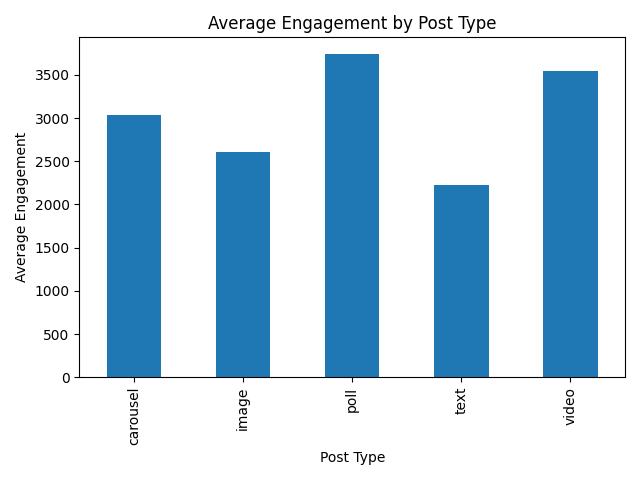

# Social Media Engagement Analysis

## Project Overview

This project analyzes social media engagement across multiple platforms using Python. The goal is to understand which platforms and content types generate the highest engagement. Engagement is calculated using a simple metric based on user interactions with posts.

The analysis explores patterns in social media performance and demonstrates common data analytics tasks such as data loading, feature engineering, aggregation, and visualization.

## Dataset

The dataset contains 100 social media posts collected across three platforms:

* Facebook
* Instagram
* Twitter

Each record includes information such as:

* Platform
* Post Type
* Post Time
* Post Day
* Likes
* Comments
* Shares
* Sentiment Score

These variables allow us to evaluate how engagement varies across platforms and content types.

## Engagement Metric

To measure engagement, a new feature was created:

Engagement = Likes + Comments + Shares

This metric provides a simple way to compare how users interact with posts across platforms.

## Analysis Performed

The following analyses were performed:

* Created an engagement metric
* Calculated average engagement by platform
* Calculated average engagement by post type
* Visualized engagement patterns using bar charts

These steps replicate the type of exploratory analysis commonly performed in marketing and social media analytics.

## Visualizations

### Average Engagement by Platform


### Average Engagement by Post Type



## Tools Used

This project was built using the following tools:

* Python
* Pandas
* Matplotlib
* Git
* GitHub
* Visual Studio Code

## Project Structure

```
social-media-analytics-project
│
├── data
│   ├── raw
│   └── cleaned
│
├── scripts
│   └── clean_data.py
│
├── visuals
│   ├── engagement_by_platform.png
│   └── engagement_by_post_type.png
│
├── notebooks
├── sql
├── README.md
└── requirements.txt
```

## Key Takeaways

* Instagram generates the highest average engagement.
* Facebook performs moderately well.
* Twitter shows the lowest engagement in this dataset.
* Certain post types generate higher engagement than others.

These insights demonstrate how data analysis can support marketing and social media strategy decisions.

## Future Improvements

Potential improvements to this project include:

* Time-based engagement analysis
* Sentiment vs engagement comparison
* Hashtag performance analysis
* Building an interactive dashboard
* Connecting to social media APIs for live data

## Author

Hunter Sarkis
Master’s Student – Data Analytics
Grand Canyon University
