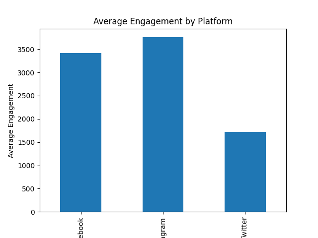

# Social Media Engagement Analysis

This project analyzes social media engagement across platforms using Python.

## Dataset
The dataset includes 100 social media posts across Facebook, Instagram, and Twitter.

Features include:
- platform
- post type
- likes
- comments
- shares
- sentiment score

## Analysis Performed
- Created engagement metric (likes + comments + shares)
- Calculated average engagement by platform
- Visualized engagement using a bar chart

## Tools Used
- Python
- Pandas
- Matplotlib
- Git
- GitHub

## Visualization

Average engagement by platform:

